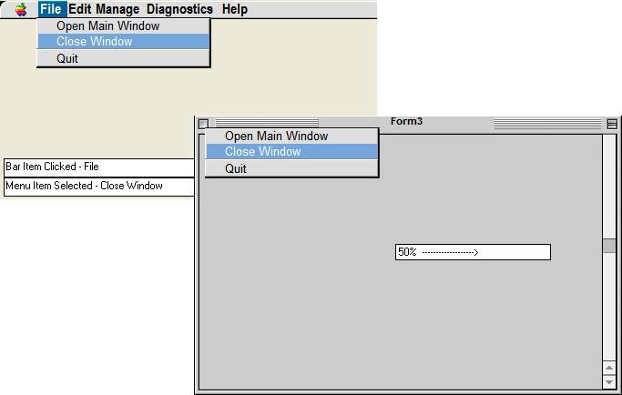



## Macintosh CONTROLS \+ Skins \(Update\) Works & Looks a lot better

### Description

This contains new and updated controls that mirror the actions and looks of the Macintosh system. THe menus are much better. Updated rollover effects. Also added a custom Scrollbar. NO NEED TO EDIT ANY "UserControls"! I added many RaiseEvent commands to these controls to make them easier to use. All controls are now more stable also. This comes with a demo of each control so you can see how to use them. Please tell me what you think.
 
### More Info
 

             |
---                |---
**Submitted On**   |2004-01-15 21:37:36
**By**             |[Eric Wolcott](https://github.com/Planet-Source-Code/PSCIndex/blob/master/ByAuthor/eric-wolcott.md)
**Level**          |Intermediate
**User Rating**    |5.0 (10 globes from 2 users)
**Compatibility**  |VB 3\.0, VB 4\.0 \(16\-bit\), VB 4\.0 \(32\-bit\), VB 5\.0, VB 6\.0, VB Script
**Category**       |[Custom Controls/ Forms/  Menus](https://github.com/Planet-Source-Code/PSCIndex/blob/master/ByCategory/custom-controls-forms-menus__1-4.md)
**World**          |[Visual Basic](https://github.com/Planet-Source-Code/PSCIndex/blob/master/ByWorld/visual-basic.md)
**Archive File**   |[Macintosh\_1694941152004\.zip](https://github.com/Planet-Source-Code/eric-wolcott-macintosh-controls-skins-update-works-looks-a-lot-better__1-51036/archive/master.zip)

